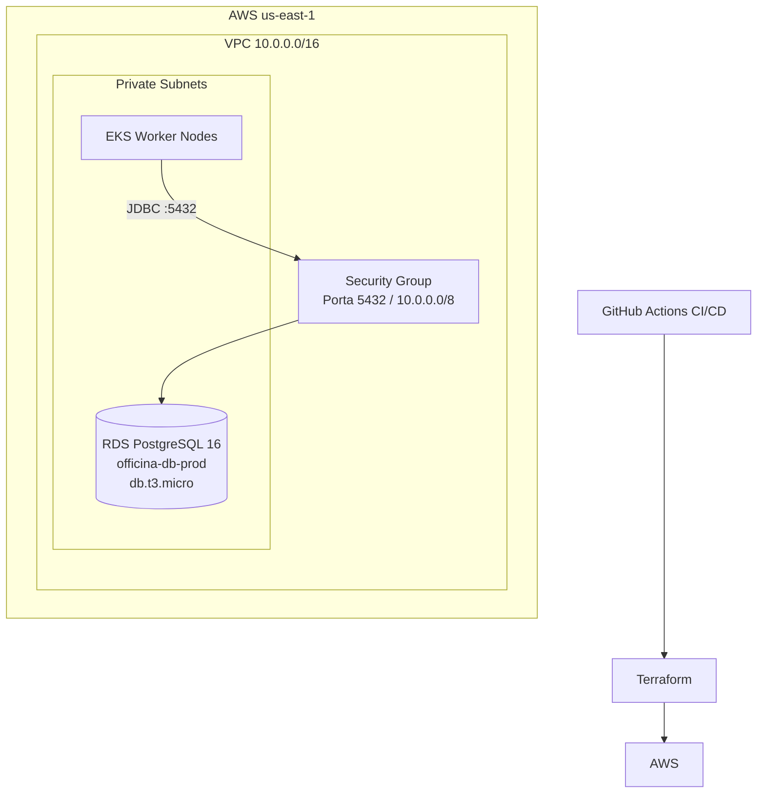

# fiap-tech-challenge-db-terraform

> **Fase 4 (Tech Challenge):** o RDS PostgreSQL provisionado neste repositório passa a ser de uso **exclusivo do OS Service**. Os demais microsserviços (Billing e Execution) usam MongoDB próprio, provisionado via Helm em `fiap-tech-challenge-k8s-terraform`. Veja a visão geral em `docs/arquitetura/fase4-visao-geral.md` no repositório `fiap-tech-challenge-app` e a decisão em [`docs/ADRs/ADR-001-rds-dedicado-os-service.md`](docs/ADRs/ADR-001-rds-dedicado-os-service.md).

## Propósito

Infraestrutura como código (IaC) para provisionar o banco de dados PostgreSQL na AWS usando Terraform. Este repositório cria a instância RDS, security group e subnet group dentro da VPC provisionada pelo repositório `k8s-terraform`.

**Faz parte do Tech Challenge Fase 3 — FIAP SOAT.**

> **Dependência**: este repositório precisa dos outputs do [fiap-tech-challenge-k8s-terraform](https://github.com/ThaisAzuos/fiap-tech-challenge-k8s-terraform) (`vpc_id` e `private_subnet_ids`). Provisione o cluster EKS primeiro.

## Arquitetura



## Tech Stack

- **Terraform** >= 1.0
- **AWS Provider** ~> 5.0
- **Amazon RDS** PostgreSQL 16 (`db.t3.micro`)
- **Backend S3** para armazenar o Terraform state

## Estrutura do Projeto

```
.
├── main.tf              ← Security Group, DB Subnet Group e chamada do módulo RDS
├── variables.tf         ← Variáveis de entrada (vpc_id, private_subnet_ids, db_password…)
├── outputs.tf           ← Outputs exportados (db_address, db_port, db_name…)
├── versions.tf          ← Versões dos providers e backend S3
└── modules/
    └── rds/
        ├── main.tf      ← Recurso aws_db_instance
        ├── variables.tf ← Variáveis do módulo
        └── outputs.tf   ← Outputs do módulo (endereço, porta, nome)
```

## Pré-requisitos

- [Terraform CLI](https://developer.hashicorp.com/terraform/downloads) >= 1.0
- [AWS CLI](https://aws.amazon.com/cli/) configurado com credenciais válidas
- Cluster EKS e VPC já provisionados (outputs de `vpc_id` e `private_subnet_ids`)
- Bucket S3 para armazenar o Terraform state (ex: `fiap-tc-terraform-state`)

> **AWS Academy**: use as credenciais temporárias do painel "AWS Details" > "Show". Elas expiram a cada ~4h.

## Quick Start

### 1. Configurar credenciais AWS

```bash
aws configure set aws_access_key_id     SEU_ACCESS_KEY
aws configure set aws_secret_access_key SEU_SECRET_KEY
aws configure set aws_session_token     SEU_SESSION_TOKEN
aws configure set region                us-east-1
```

### 2. Criar arquivo de variáveis

Crie `terraform.tfvars` na raiz (não commitar — já está no `.gitignore`):

```hcl
environment            = "prod"
db_instance_identifier = "oficina-db-prod"
db_name                = "oficina"
db_username            = "oficina_admin"
db_password            = "SuaSenhaSeguraAqui"
db_instance_class      = "db.t3.micro"
db_engine_version      = "16"
db_allocated_storage   = 20

# Obter dos outputs do k8s-terraform:
# terraform output vpc_id
# terraform output -json private_subnet_ids
vpc_id             = "vpc-xxxxxxxxxxxxxxxxx"
private_subnet_ids = ["subnet-xxxxxxxxxxxxxxxxx", "subnet-yyyyyyyyyyyyyyyyy"]
```

### 3. Inicializar e aplicar

```bash
terraform init \
  -backend-config="bucket=SEU_BUCKET_S3" \
  -backend-config="key=rds/terraform.tfstate" \
  -backend-config="region=us-east-1"

terraform plan \
  -var "vpc_id=vpc-xxx" \
  -var 'private_subnet_ids=["subnet-xxx","subnet-yyy"]'

terraform apply \
  -var "vpc_id=vpc-xxx" \
  -var 'private_subnet_ids=["subnet-xxx","subnet-yyy"]'
```

## Outputs

Após o `terraform apply`, os seguintes valores são exportados (usados pelos outros repos):

| Output | Descrição | Usado por |
|--------|-----------|-----------|
| `db_address` | Endpoint do RDS (hostname) | app → `DB_HOST`; lambda → `DB_HOST` |
| `db_port` | Porta do PostgreSQL (5432) | app → `DB_PORT` |
| `db_name` | Nome do banco de dados | app → `DB_NAME` |
| `db_username` | Usuário master do banco | app → `DB_USER` |
| `db_arn` | ARN da instância RDS | referência interna |

Para consultar os outputs após o apply:

```bash
terraform output db_address
```

## Deploy CI/CD (GitHub Actions)

O pipeline possui 3 jobs executados em sequência:

1. **terraform-validate** — inicializa, valida sintaxe e verifica formatação (`terraform fmt -check`)
2. **terraform-plan** — gera o plano de execução; em Pull Requests, posta o plano como comentário
3. **terraform-apply** — aplica na AWS (somente push para `main`)

**Secrets necessários no repositório:**

| Secret | Descrição |
|--------|-----------|
| `AWS_ACCESS_KEY_ID` | Credencial AWS |
| `AWS_SECRET_ACCESS_KEY` | Credencial AWS |
| `AWS_SESSION_TOKEN` | Token de sessão (AWS Academy) |
| `TF_STATE_BUCKET` | Nome do bucket S3 para o state |
| `DB_PASSWORD` | Senha do banco de dados |
| `VPC_ID` | ID da VPC (output do k8s-terraform) |
| `PRIVATE_SUBNET_IDS` | Lista JSON das subnets privadas (output do k8s-terraform) |

## Custo Estimado (AWS Academy)

| Recurso | Custo |
|---------|-------|
| RDS db.t3.micro (PostgreSQL 16) | ~$13/mês ($0.017/h) |
| Storage 20 GB gp2 | ~$2/mês |
| **Total estimado** | **~$15/mês** |

> No AWS Academy o custo é coberto pelos créditos do laboratório.

## Limpeza de Recursos

```bash
terraform destroy \
  -var "vpc_id=vpc-xxx" \
  -var 'private_subnet_ids=["subnet-xxx","subnet-yyy"]'
```

## Repositórios Relacionados

| Repo | Descrição |
|------|-----------|
| [fiap-tech-challenge-k8s-terraform](https://github.com/ThaisAzuos/fiap-tech-challenge-k8s-terraform) | Cluster EKS — **provisione antes deste repo** |
| [fiap-tech-challenge-lambda-auth](https://github.com/ThaisAzuos/fiap-tech-challenge-lambda-auth) | Autenticação serverless Lambda — usa `db_address` deste repo |
| [fiap-tech-challenge-app](https://github.com/ThaisAzuos/fiap-tech-challenge-app) | Aplicação principal Spring Boot — usa `db_address` deste repo |
