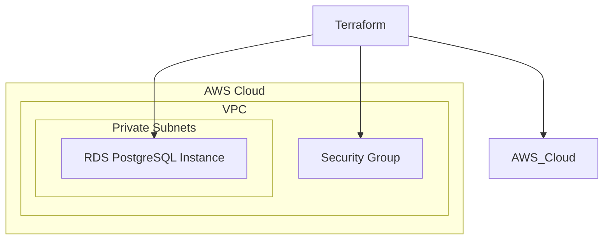

# fiap-tech-challenge-db-terraform

## 🎯 Propósito
Este repositório contém a infraestrutura como código (IaC) para provisionar e gerenciar o banco de dados PostgreSQL na AWS, utilizando Terraform. Ele é responsável por criar a instância RDS, grupos de segurança e subnets necessários para o funcionamento do banco de dados da aplicação principal.

## 🛠️ Tech Stack
- **Linguagem/Ferramenta**: HashiCorp Terraform
- **Provedor Cloud**: AWS
- **Serviço**: Amazon RDS for PostgreSQL (versão 15.2)

## 📊 Arquitetura

*Diagrama simplificado. A VPC e subnets são geralmente provisionadas por um módulo de rede separado ou pelo módulo EKS.*

## 🚀 Quick Start (Setup Local)
Para configurar e aplicar a infraestrutura do banco de dados localmente, siga os passos abaixo:

1.  **Pré-requisitos**:
    *   Terraform CLI instalado (versão 1.0.0 ou superior).
    *   AWS CLI configurado com credenciais de acesso e permissões adequadas.

2.  **Clonar o repositório**:
    ```bash
    git clone https://github.com/fiap-tech-challenge/fiap-tech-challenge-db-terraform.git
    cd fiap-tech-challenge-db-terraform
    ```

3.  **Inicializar o Terraform**:
    ```bash
    terraform init
    ```

4.  **Planejar a infraestrutura**:
    Crie um arquivo `terraform.tfvars` na raiz do projeto com as variáveis necessárias (substitua os valores de exemplo):
    ```hcl
    aws_region               = "us-east-1"
    environment              = "development"
    db_instance_identifier   = "oficinamecanica-db-dev"
    db_name                  = "oficinamecanica"
    db_username              = "admin"
    db_password              = "SuaSenhaSeguraAqui" # Use uma senha forte e segura
    vpc_security_group_ids   = ["sg-xxxxxxxxxxxxxxxxx"] # ID do Security Group da sua VPC
    db_subnet_group_name     = "sua-db-subnet-group" # Nome do DB Subnet Group da sua VPC
    ```
    Em seguida, execute o plano:
    ```bash
    terraform plan
    ```

5.  **Aplicar a infraestrutura**:
    ```bash
    terraform apply
    ```
    Confirme a aplicação digitando `yes` quando solicitado.

## 📋 Deploy (CI/CD)
O deploy da infraestrutura do banco de dados é automatizado via GitHub Actions.

-   **Workflow**: `.github/workflows/main.yml`
-   **Gatilhos**: `push` para a branch `main` e `pull_request` para a branch `main`.
-   **Etapas**:
    1.  `terraform init`: Inicializa o Terraform.
    2.  `terraform validate`: Valida a sintaxe e configuração do Terraform.
    3.  `terraform plan`: Gera um plano de execução (executado em Pull Requests).
    4.  `terraform apply`: Aplica as mudanças na AWS (executado em `push` para `main`, requer aprovação manual).

**Secrets Necessários no GitHub Actions**:
-   `AWS_ACCESS_KEY_ID`
-   `AWS_SECRET_ACCESS_KEY`
-   `DB_PASSWORD` (para a senha do banco de dados)

## 🔗 Links Relacionados
-   [Aplicação Principal (fiap-tech-challenge-app)](../fiap-tech-challenge-app)
-   [Infraestrutura Kubernetes (fiap-tech-challenge-k8s-terraform)](../fiap-tech-challenge-k8s-terraform)
-   [Autenticação Lambda (fiap-tech-challenge-lambda-auth)](../fiap-tech-challenge-lambda-auth)
-   [Documentação Geral da Fase 3](../../docs/Fase03/ADRs.md)
